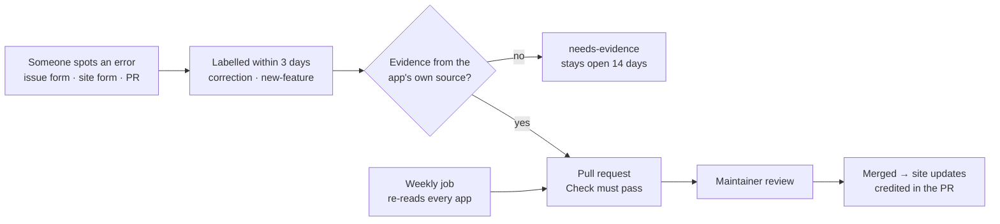

# Fitness app comparison

[](https://github.com/AwesomeZaidi/fitness-app-comparison/actions/workflows/validate.yml)
[](https://github.com/AwesomeZaidi/fitness-app-comparison/actions/workflows/weekly.yml)
[](LICENSE)
[](data/LICENSE.md)

The data and code behind **[splyt.fit/compare](https://splyt.fit/compare)**. It compares six iOS workout trackers (SPLYT, Hevy, Strong, Gravl, Fitbod and Motra) on **188 features**, built bottom-up from what each app says about itself. It also has a scoreboard of how many new features each app has named in its release notes recently.

Everything the page shows is in this repository: every claim each app makes about itself, how each claim was judged, how claims were merged into features, the scripts that build and check the result, and a human-readable record of every decision in **[MERGE-LOG.md](MERGE-LOG.md)**. If something is wrong, you can show us and we will change it.

## Who made this, and why that matters

**SPLYT made this comparison, and SPLYT is one of the six apps in it.** That is a conflict of interest, and you should read the results with it in mind.

Here is how the rules try to limit that bias. None of them removes it entirely:

- **The features weren't hand-picked.** The list is the union of every capability any of the six apps claims about itself in its own public material. A feature is in the list because some app documents it, not because SPLYT chose it. (An earlier version of this repository used 52 features hand-picked by SPLYT. It has been replaced.)
- **The same rules for all six, SPLYT included.** Every app's claims were collected with the same brief ([`tooling/EXTRACTION-BRIEF.md`](tooling/EXTRACTION-BRIEF.md)), vetted with the same classes, and scored with the same rules. SPLYT's column is no longer self-reported: every SPLYT yes, partial and no cites a source and a quote, like every other app's (SPLYT's website, feature index, App Store and Google Play pages, plus, for 16 cells, its in-app What's New screen).
- **Every yes, partial and no has a source and a quote.** You can check each one yourself in [`data/matrix.json`](data/matrix.json).
- **"No" needs evidence.** A cell is "no" only when the app's own sources or its store listing show the feature is absent or was removed. Otherwise it is "unknown".
- **Every judgement is written down.** Merging claims into features, rejecting claims and overriding cells are all data in [`tooling/merge/mapping.py`](tooling/merge/mapping.py), and every one is listed with its reason in [MERGE-LOG.md](MERGE-LOG.md).
- **SPLYT still made the judgement calls.** SPLYT wrote the brief, decided how claims were grouped into features, and vetted every claim. The rules are designed so you can check those decisions, not so you have to trust them.

The full rules are in [METHODOLOGY.md](METHODOLOGY.md).

## Results

### Features (188 compared, built 2026-10-09)

| App | Yes | % of 188 | Partial | No | Unknown |
|---|---:|---:|---:|---:|---:|
| SPLYT ¹ | 133 | 70.7% | 1 | 4 | 50 |
| Hevy | 120 | 63.8% | 0 | 4 | 64 |
| Gravl | 109 | 58.0% | 2 | 3 | 74 |
| Motra | 104 | 55.3% | 1 | 3 | 80 |
| Fitbod | 91 | 48.4% | 6 | 4 | 87 |
| Strong ² | 72 | 38.3% | 1 | 5 | 110 |

¹ SPLYT published its feature index, [splyt.fit/features](https://splyt.fit/features), on **2026-10-09, the day of this comparison**. It was treated as a help centre, like every other app's. **Without it, SPLYT scores 125 (66%)**, still first; 8 SPLYT cells depend on it alone. The index was also used *against* SPLYT: SPLYT describes it as complete, so SPLYT marketing claims it does not back (a daily strain score, using the watch without the phone, body circumference measurements, watching a friend's sets live) were marked unsubstantiated and not counted. No other app's help centre claims to be complete, so no other app could be held to that test.

² Strong's features page is password-protected and it has the fewest claims (120), so many of its 110 unknowns may be features Strong has but does not document in the pages that could be read.

**Read the scores as "how much each app documents", not "how much each app can do".** An app that writes more release notes and help articles gets more cells marked yes. **"Unknown" is not "no"**: it means the app's own material, as read, does not show the feature. Only "yes" counts toward the totals; "partial", "no" and "unknown" add nothing, and features are not weighted.

Some details that help read the table:

- **32 of the 188 features are "yes" for all six apps.**
- **SPLYT is not "yes" on 55 features.** It is "no" on 4: Android, Mac, languages other than English, and nutrition logging (removed). It is "partial" on following a friend's workout live. The other 50 are unknown, and they include whole areas where other apps lead: SPLYT is "yes" on only 3 of 13 automatic-programming features (Gravl and Fitbod: 13).

#### Category leaders (most "yes" cells in the category)

| Category | Features | Leader(s) |
|---|---:|---|
| Workout logging | 25 | SPLYT (22) |
| Sets, supersets & loading | 12 | SPLYT, Hevy (11) |
| Templates, plans & calendar | 13 | SPLYT (10) |
| Automatic programming | 13 | Gravl, Fitbod (13) |
| AI & voice | 8 | SPLYT (5) |
| Exercise library & content | 10 | SPLYT, Gravl, Fitbod, Motra (7) |
| Stats & progress | 17 | Hevy (15) |
| Health, body & recovery | 14 | SPLYT (11) |
| Cardio, sports & other activities | 8 | SPLYT (8) |
| Apple Watch & wearables | 16 | Hevy, Gravl, Motra (9) |
| Social & competition | 16 | SPLYT, Hevy (13) |
| Sharing, import/export & integrations | 12 | Hevy (9) |
| Platforms, widgets & system | 14 | Hevy (10) |
| Personalisation, account & support | 10 | Gravl (8) |

The full per-app breakdown by category is in [`data/scores.md`](data/scores.md).

#### Features documented by only one app ("yes" for it, "no" or "unknown" for all five others)

- **SPLYT (15):** Search workout history, Planning calendar, Apple Calendar sync, AI progress-photo analysis, Sleep tracking, Steps tracking, Activity rings in the app, Habit and daily-goal tracking, Non-lifting activity types, Multi-activity sessions, GPS outdoor tracking, Swim tracking, Read a cardio machine screen by photo, Groups, Competitions and challenges
- **Gravl (7):** Programs from named coaches, Form analysis from video, Offline exercise videos, Garmin watch app, Garmin Connect sync, Public developer API, Distraction blocking during workouts
- **Fitbod (3):** Head-gesture logging, Strava import, Mac (Apple silicon) availability
- **Motra (3):** Lifting tempo tracking, Automatic exercise detection, Control Center control
- **Hevy (2):** Connect your personal trainer, iMessage stickers
- **Strong (2):** Hide, merge or reset exercise data, Calorie and macro logging

Most of these are "unknown", not "no", for the other apps. The reverse list (features all five other apps document and one does not) is in [`data/scores.md`](data/scores.md); for SPLYT it is per-exercise weight units and languages other than English.

### How the feature list was built

1. **Collect.** For each app, a separate pass read only that app's own public material — App Store listing and release notes, website, help centre or FAQ, and Google Play for Android availability — and recorded every capability the app claims, each with a verbatim quote, URL, source type and date. Every app got the same brief, and no pass saw another app. Raw claims: [`data/claims/`](data/claims/).

   | App | Claims |
   |---|---:|
   | SPLYT | 535 (247 from its App Store, website and in-app What's New; 288 from its 2026-10-09 feature index) |
   | Hevy | 233 |
   | Gravl | 174 |
   | Motra | 159 |
   | Fitbod | 141 |
   | Strong | 120 |

2. **Vet.** Every claim was put in one class before scoring ([`data/vetting.json`](data/vetting.json)). Only `capability` and `aspect` claims count.

   | Class | Counts? | SPLYT | Hevy | Strong | Gravl | Fitbod | Motra |
   |---|---|---:|---:|---:|---:|---:|---:|
   | `capability` — a concrete capability | yes | 244 | 124 | 83 | 111 | 92 | 95 |
   | `aspect` — a setting or variant of a parent feature | under its parent | 260 | 107 | 32 | 59 | 46 | 54 |
   | `unsubstantiated` — marketing contradicted by, or missing from, the app's more detailed sources | no | 9 | 0 | 2 | 1 | 1 | 1 |
   | `not_shipped` — rolling out or beta | partial at most | 0 | 0 | 0 | 0 | 2 | 1 |
   | `fix` — bug fix, speed or reliability | no | 0 | 0 | 3 | 3 | 0 | 2 |
   | `ui_tweak` — layout, redesign or copy | no | 16 | 2 | 0 | 0 | 0 | 3 |
   | `vague` — a name that doesn't say what it does | no | 0 | 0 | 0 | 0 | 0 | 3 |
   | `out_of_scope` — pricing or plan limits | no | 6 | 0 | 0 | 0 | 0 | 0 |
   | **Not counted** | | **31** | **2** | **5** | **4** | **3** | **10** |

   SPLYT had the most claims rejected (31 of 535).

3. **Canonicalise.** Claims were merged into features a typical lifter would recognise as a distinct thing to look for. Settings and small variants became **aspects** of a parent feature: shown, not scored on their own. The same granularity was applied to every app — for example, SPLYT's 13 separate voice claims became one feature, "Voice logging", and its competition details are aspects of one feature. Related but different capabilities stay separate (auto rep counting ≠ auto exercise detection; Garmin ≠ Wear OS). A feature exists only if some app currently documents it with a counted claim. Result: 188 features in 14 categories.

4. **Score.** **yes** = at least one counted claim from the app's own sources whose quote shows the capability. **partial** = the app's own evidence states a material limitation (rolling out, beta, Android-only). **no** = explicit evidence of absence or removal, from the app's own sources or its store listing. **unknown** = everything else. Platform rows (iPad, Mac, Vision Pro, languages) were read from each app's App Store compatibility section, the same way for all six.

**What is automated and what isn't.** Extraction (step 1) is an AI-assisted step: an AI model read each app's sources following [`tooling/EXTRACTION-BRIEF.md`](tooling/EXTRACTION-BRIEF.md), and the maintainer reviewed the result. Vetting and grouping (steps 2–3) are human judgements recorded as data in [`tooling/merge/mapping.py`](tooling/merge/mapping.py). Merging, scoring and validation are deterministic scripts: `npm run build:matrix` rebuilds every output from the claims and the mapping, and the Check workflow fails if the committed data differs from the rebuild.

**[MERGE-LOG.md](MERGE-LOG.md)** is the audit trail: every feature with the claims merged into it, every rejected claim with its reason, every cell that differs from a naive mapping (44), the hardest judgement calls, and the features apps have removed.

### Release pace (new features named in release notes, 2026-08-24 to 2026-10-08)

| App | New features named | Counted from | App Store releases in the window |
|---|---:|---|---|
| SPLYT ³ | 120 | In-app "What's New" (self-reported) | 9 |
| Gravl | 11 | App Store release notes | 5 |
| Hevy | 5 | App Store release notes | 6 (the last 4 repeat earlier notes word for word) |
| Strong | 0 | App Store release notes | 1 (fixes only) |
| Fitbod | 0 | App Store release notes | 6 (each says "Bug fixes and improvements") |
| Motra | 0 | App Store release notes | 0 (last release 2026-08-10) |

³ **These numbers are not measured the same way.**
- **SPLYT's count** comes from its in-app "What's New" screen. That screen lists every build, including over-the-air updates that never appear as a separate App Store release.
- **The other apps' counts** come from their App Store release notes only. They may also ship things those notes don't mention.
- **We cross-checked outside the App Store** (websites, blogs, help centres, Google Play) and found nothing else that shipped in the window. Two borderline items are recorded but not counted: Fitbod's Family Plan, which is pricing rather than an app feature, and an update to Gravl's separate Macros app. Both are in [`data/pace-crosscheck-2026-10-08.json`](data/pace-crosscheck-2026-10-08.json).
- **We haven't yet counted SPLYT's own App Store notes the same way as everyone else's.** Its App Store history is in [`data/releases/splyt.json`](data/releases/splyt.json) if you want to.

How we count:
- Fixes, speed-ups and reliability items don't count for anyone.
- Notes repeated from the previous release don't count twice.
- "Bug fixes and improvements" names nothing, so it counts as nothing.
- When a competitor's note could be either a new feature or an improvement, we count it as new.

The 2026-08-24 start date is SPLYT's App Store relaunch (version 1.0.18).

## How to verify

**Without code:**
1. Open [`data/matrix.json`](data/matrix.json) in your browser on GitHub.
2. Find a feature, for example `"auto-rep-counting"` (ids are in [`data/features.json`](data/features.json)).
3. Each app has a `value`, a `quote`, the `url` it came from, its `sourceType` and `date`, and, where the cell was decided by a rule rather than a single claim, a `note`. Open the link and check that it says what the quote says.
4. `claim` (for example `"hevy:94"`) points to the raw claim in [`data/claims/`](data/claims/); [`data/vetting.json`](data/vetting.json) says how that claim was classified and why.

Sixteen SPLYT cells cite SPLYT's in-app What's New screen (Profile → Tools → What's New) rather than a web page; their `url` names the build. You can read that screen in the app.

For the scoreboard:
1. Open any app's page on the App Store.
2. Tap **Version History** and compare it with [`data/releases/<app>.json`](data/releases/). Each release lists the features we counted (`features`) and the items we deliberately didn't count (`notCounted`).

**With code (Node 20 or newer, Python 3 for the rebuild; no install step, no dependencies):**

```sh
npm run build:matrix                                   # rebuilds features, matrix, scores, vetting and MERGE-LOG.md from data/claims + tooling/merge/mapping.py
node scripts/validate.mjs                              # checks every rule in METHODOLOGY.md that can be checked mechanically
node scripts/compute-pace.mjs --to 2026-10-08 --stdout # recomputes the scoreboard from data/releases/
node scripts/fetch-releases.mjs --dry                  # re-reads every App Store version history now
node scripts/fetch-listings.mjs --dry                  # re-reads every App Store listing now
```

After `npm run build:matrix`, `git status` should show no changes.

## Who maintains this, and how changes happen

Maintained by **[Asim Zaidi](https://github.com/AwesomeZaidi)**, co-founder of SPLYT. Every change to `data/` goes through a pull request: the `Check` workflow validates it and runs the tests, and the maintainer reviews the evidence before it merges. Nothing changes on [splyt.fit/compare](https://splyt.fit/compare) without a merged pull request here.



- **Response time:** every issue gets a first reply within **3 days** and a decision within **14 days**.
- **Corrections to SPLYT's own cells** are handled first, not last.
- **Disagreements** are settled by sources, not by the maintainer's opinion. If two sources from the same app conflict, the more detailed one wins (a help centre over marketing copy), and the conflict is noted in the cell and in MERGE-LOG.md.
- **Want to help maintain it?** Open an issue titled "Maintainer" — reviewers from outside SPLYT are especially welcome.

## Corrections

If a value is wrong, [open a correction](../../issues/new?template=correction.yml). Include a link to an allowed source and the sentence that supports the change. Corrections to SPLYT's column are handled the same way. If you think two features should be merged or split, or a claim was classified wrongly, that is a correction too — cite the feature id or the claim (for example `hevy:94`).

If an app documents a feature that is missing from the list, use [suggest a feature](../../issues/new?template=new-feature.yml).

Pull requests are welcome too. See [CONTRIBUTING.md](CONTRIBUTING.md).

Every Monday, an automated job re-reads the App Store and opens a pull request listing new releases and listing changes. **Nothing merges automatically.** A person classifies new releases and makes any change to the comparison, with a source. The feature list is not re-extracted automatically.

## App Store rankings

[splyt.fit/apps](https://splyt.fit/apps) lists every iOS workout tracker we can find, refreshed daily from Apple's public data. It ranks them by chart position, ratings gained and total ratings. **[RANKINGS.md](RANKINGS.md)** is the full method: sources, search terms, the exact labelling instructions, and the rule behind every list. Each week the published lists are exported to `data/rankings/`, so any past ranking can be checked.

## What's in here

```
MERGE-LOG.md           the audit trail: every feature, every merged claim, every rejected claim and why (generated)
data/
  claims/<app>.json    raw claims each app makes about itself: feature, quote, url, sourceType, date
  claims/splyt-index.json  claims from SPLYT's feature index (splyt.fit/features, published 2026-10-09)
  vetting.json         every claim's class and reason (generated)
  features.json        the 188 features: id, name, definition, category, aspects, member claims (generated)
  matrix.json          one cell per feature per app: value, quote, url, sourceType, date, note, claim (generated)
  scores.json          totals, category counts, unique features, vetting counts (generated); scores.md is the same as tables
  apps.json            the six apps: App Store id, developer, official domains
  releases/<app>.json  App Store version history, with what was counted
  releases/splyt-whats-new.json   SPLYT's in-app What's New entries in the window
  pace.json            the scoreboard (generated: scripts/compute-pace.mjs)
  pace-crosscheck-2026-10-08.json sources checked outside the App Store
  snapshots/<app>/     App Store listing snapshots (description, version, notes)
  rankings/<day>.json  the lists published on splyt.fit/apps that day (weekly export: scripts/export-rankings.mjs)
tooling/
  EXTRACTION-BRIEF.md  the brief every app's claim extraction followed
  merge/mapping.py     every grouping, vetting and override judgement, as data
  merge/build.py       deterministic build of the generated files above (npm run build:matrix)
scripts/               fetch, compute, validate and report (Node 20, no dependencies)
test/                  tests for the scripts and the published data (npm test)
.github/               weekly refresh, checks on every PR, issue and PR templates
```

## Scope

- **Six apps for now.** We may add others.
- **iPhone apps on the US App Store.** A "yes" means the feature exists in at least one tier, free or paid. The cells don't separate free from paid.
- **A snapshot in time.** Claims were collected on 2026-10-09, and each cell carries its source's `date` where the source is dated. Apps change, so check before relying on a value.
- **What apps document, not what they can do.** See the note under the results table.

## License

- **Code** (`scripts/`, `tooling/merge/`, `.github/`) is MIT. See [LICENSE](LICENSE).
- **Data** (`data/`) is [CC BY 4.0](https://creativecommons.org/licenses/by/4.0/). See [data/LICENSE.md](data/LICENSE.md). Please credit "fitness-app-comparison by SPLYT" and link here, or to [splyt.fit/compare](https://splyt.fit/compare) or [splyt.fit/apps](https://splyt.fit/apps).
- **Text quoted from the apps' own material** — App Store listings, release notes, websites and help centres — in `data/claims/`, `data/releases/`, `data/snapshots/`, `data/matrix.json` and `MERGE-LOG.md` belongs to the developers who wrote it. It is included so the data can be verified. The CC BY license covers our compilation and annotations, not their text.

App names and trademarks belong to their owners. None of the other five apps reviewed or endorsed this comparison.

## Run it yourself

```sh
git clone https://github.com/AwesomeZaidi/fitness-app-comparison
cd fitness-app-comparison
npm run check          # validate the data and run the tests (no install needed)
npm run build:matrix   # rebuild the feature list, matrix and scores from the claims (Python 3)
npm run fetch          # re-read every app's App Store page and listing
npm run pace           # recompute the release-pace scoreboard
```

Node 20 or newer, and Python 3 for `build:matrix`. No dependencies.
