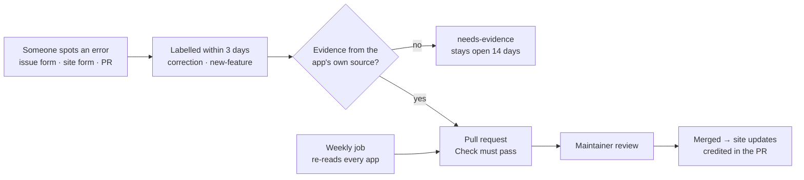

# Fitness app comparison

[](https://github.com/AwesomeZaidi/fitness-app-comparison/actions/workflows/validate.yml)
[](https://github.com/AwesomeZaidi/fitness-app-comparison/actions/workflows/weekly.yml)
[](LICENSE)
[](data/LICENSE.md)

The data and code behind **[splyt.fit/compare](https://splyt.fit/compare)**. It compares six iOS workout trackers (SPLYT, Hevy, Strong, Gravl, Fitbod and Motra) on 52 features. It also has a scoreboard of how many new features each app has named in its release notes recently.

Everything the page shows is in this repository: each value, where it came from, and the scripts that collect and check it. If something is wrong, you can show us and we will change it.

## Who made this, and why that matters

**SPLYT made this comparison, and SPLYT is one of the six apps in it.** That is a conflict of interest, and you should read the results with it in mind.

Here is how the rules try to limit that bias. None of them removes it entirely:

- **Every competitor value links to a public source.** That means the app's own App Store page, website, help centre, blog or Google Play listing. You can check each one yourself in [`data/matrix.json`](data/matrix.json).
- **"No" needs evidence.** We only mark a competitor "no" if an official source says so, or if a thorough official feature list leaves it out. If we couldn't find evidence either way, the value is "unknown", not "no".
- **Only confirmed "yes" values count toward the totals.** "Partial" and "unknown" don't add anything.
- **SPLYT's own column is self-reported.** It was checked against SPLYT's source code, which is not public, so you can't verify it the same way. It is open to challenge like any other column (see [Corrections](#corrections)).
- **SPLYT chose the 52 features.** A company's list tends to include the things that company has built. We say so here instead of hiding it, and we welcome suggestions for features SPLYT doesn't have.

The full rules are in [METHODOLOGY.md](METHODOLOGY.md).

## Results

### Features (52 compared, checked 2026-10-08)

| App | Confirmed yes | % of 52 | Partial | No | Unknown |
|---|---:|---:|---:|---:|---:|
| SPLYT ¹ | 45 | 87% | 3 | 4 | 0 |
| Gravl | 31 | 60% | 12 | 1 | 8 |
| Hevy | 31 | 60% | 8 | 4 | 9 |
| Fitbod | 27 | 52% | 11 | 1 | 13 |
| Motra | 25 | 48% | 7 | 2 | 18 |
| Strong | 23 | 44% | 4 | 6 | 19 |

¹ Self-reported, checked against SPLYT's own code. It has no "unknown" values because SPLYT's makers know what their app does. The other apps were checked from public documents, and anything we couldn't confirm stayed "unknown". **An unknown is not a no.** Apps with less public documentation, Strong and Motra in particular, score lower partly for that reason.

Some details that help read the table:

- **13 of the 52 features are a confirmed "yes" for all six apps.**
- **SPLYT is not a confirmed "yes" on 7 features.**
  - It has no Android app, no web app, no Garmin or Wear OS support, and no nutrition tracking.
  - It is "partial" on three:
    - **Works offline:** it logs offline and syncs later.
    - **Strava:** activities only arrive through Apple Health.
    - **Progression suggestions:** it prefills last time's weights but doesn't suggest an increase.
  - Other apps are a confirmed "yes" on five of these: Android, Garmin and other wearables, Strava, progression suggestions, and works offline (Fitbod).
- **SPLYT is the only confirmed "yes" on 11 features.** On most of them, the other apps are "unknown" rather than "no". For example, nobody else is confirmed on "Voice on the Watch" or "Follow a friend live", and the evidence for those apps is "not found", not "not offered".

### Release pace (new features named in release notes, 2026-08-24 to 2026-10-08)

| App | New features named | Counted from | App Store releases in the window |
|---|---:|---|---|
| SPLYT ² | 120 | In-app "What's New" (self-reported) | 9 |
| Gravl | 11 | App Store release notes | 5 |
| Hevy | 5 | App Store release notes | 6 (the last 4 repeat earlier notes word for word) |
| Strong | 0 | App Store release notes | 1 (fixes only) |
| Fitbod | 0 | App Store release notes | 6 (each says "Bug fixes and improvements") |
| Motra | 0 | App Store release notes | 0 (last release 2026-08-10) |

² **These numbers are not measured the same way.**
- **SPLYT's count** comes from its in-app "What's New" screen. That screen lists every build, including over-the-air updates that never appear as a separate App Store release.
- **The other apps' counts** come from their App Store release notes only. They may also ship things those notes don't mention.
- **We cross-checked outside the App Store** (websites, blogs, help centres, Google Play) and found nothing else that shipped in the window. Two borderline items are recorded but not counted: Fitbod's Family Plan, which is pricing rather than an app feature, and an update to Gravl's separate Macros app. Both are in [`data/pace-crosscheck-2026-10-08.json`](data/pace-crosscheck-2026-10-08.json).
- **We haven't yet counted SPLYT's own App Store notes the same way as everyone else's.** Its App Store history is in [`data/releases/splyt.json`](data/releases/splyt.json) if you want to.

How we count:
- Fixes, speed-ups and reliability items don't count for anyone.
- Notes repeated from the previous release don't count twice.
- "Bug fixes and improvements" names nothing, so it counts as nothing.
- When a competitor's note could be either a new feature or an improvement, we count it as new.

The 2026-08-24 start date is SPLYT's App Store relaunch (version 1.0.18).

## How to verify

**Without code:**
1. Open [`data/matrix.json`](data/matrix.json) in your browser on GitHub.
2. Find a feature, for example `"auto_rep_counting"`.
3. Each app has a `value`, a `source` link and a `note` that quotes or paraphrases that source. Open the link and check that it says what the note says.

For the scoreboard:
1. Open any app's page on the App Store.
2. Tap **Version History** and compare it with [`data/releases/<app>.json`](data/releases/). Each release lists the features we counted (`features`) and the items we deliberately didn't count (`notCounted`).

**With code (Node 20 or newer, no install step, no dependencies):**

```sh
node scripts/validate.mjs                              # checks every rule in METHODOLOGY.md that can be checked mechanically
node scripts/compute-pace.mjs --to 2026-10-08 --stdout # recomputes the scoreboard from data/releases/
node scripts/fetch-releases.mjs --dry                  # re-reads every App Store version history now
node scripts/fetch-listings.mjs --dry                  # re-reads every App Store listing now
```

## Who maintains this, and how changes happen

Maintained by **[Asim Zaidi](https://github.com/AwesomeZaidi)**, co-founder of SPLYT. Every change to `data/` goes through a pull request: the `Check` workflow validates it and runs the tests, and the maintainer reviews the evidence before it merges. Nothing changes on [splyt.fit/compare](https://splyt.fit/compare) without a merged pull request here.



- **Response time:** every issue gets a first reply within **3 days** and a decision within **14 days**.
- **Corrections to SPLYT's own cells** are handled first, not last.
- **Disagreements** are settled by sources, not by the maintainer's opinion. If two sources from the same app conflict, the more detailed and more recent one wins, and the conflict is noted in the cell.
- **Want to help maintain it?** Open an issue titled "Maintainer" — reviewers from outside SPLYT are especially welcome.

## Corrections

If a value is wrong, [open a correction](../../issues/new?template=correction.yml). Include a link to an allowed source and the sentence that supports the change. Corrections to SPLYT's column are handled the same way.

If you think a feature should be added or removed, use [suggest a feature](../../issues/new?template=new-feature.yml).

Pull requests are welcome too. See [CONTRIBUTING.md](CONTRIBUTING.md).

Every Monday, an automated job re-reads the App Store and opens a pull request listing new releases and listing changes. **Nothing merges automatically.** A person classifies new releases and makes any change to the comparison, with a source.

## What's in here

```
data/
  features.json        the 52 features: id, category, label, definition
  apps.json            the six apps: App Store id, developer, official domains
  matrix.json          one cell per feature per app: value, source, note, checkedAt
  releases/<app>.json  App Store version history, with what was counted
  releases/splyt-whats-new.json   SPLYT's in-app What's New entries in the window
  pace.json            the scoreboard (generated: scripts/compute-pace.mjs)
  pace-crosscheck-2026-10-08.json sources checked outside the App Store
  snapshots/<app>/     App Store listing snapshots (description, version, notes)
scripts/               fetch, compute, validate and report (Node 20, no dependencies)
test/                  tests for the scripts and the published data (npm test)
.github/               weekly refresh, checks on every PR, issue and PR templates
```

## Scope

- **Six apps for now.** We may add others.
- **iPhone apps on the US App Store.** A "yes" means the feature exists in at least one tier, free or paid. The cells don't separate free from paid.
- **A snapshot in time.** Each cell has a `checkedAt` date. Apps change, so check the date before relying on a value.

## License

- **Code** (`scripts/`, `.github/`) is MIT. See [LICENSE](LICENSE).
- **Data** (`data/`) is [CC BY 4.0](https://creativecommons.org/licenses/by/4.0/). See [data/LICENSE.md](data/LICENSE.md). Please credit "fitness-app-comparison" and link here.
- **Text quoted from App Store listings and release notes** in `data/releases/` and `data/snapshots/` belongs to the developers who wrote it. It is included so the data can be verified. The CC BY license covers our compilation and annotations, not their text.

App names and trademarks belong to their owners. None of the other five apps reviewed or endorsed this comparison.

## Run it yourself

```sh
git clone https://github.com/AwesomeZaidi/fitness-app-comparison
cd fitness-app-comparison
npm run check          # validate the data and run the tests (no install needed)
npm run fetch          # re-read every app's App Store page and listing
npm run pace           # recompute the release-pace scoreboard
```

Node 20 or newer. No dependencies.
